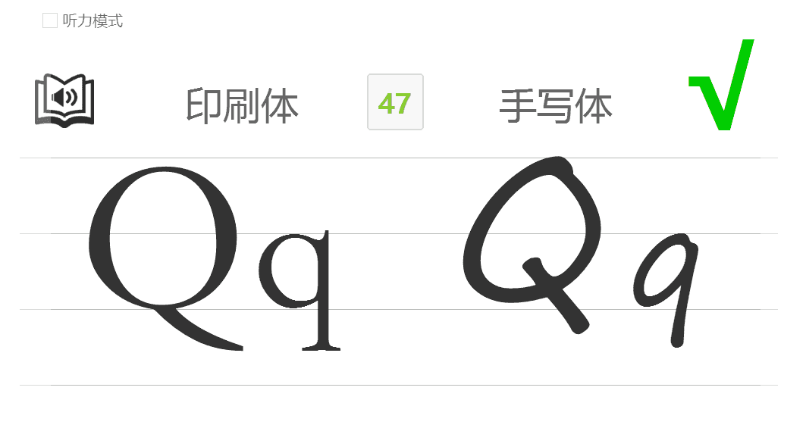
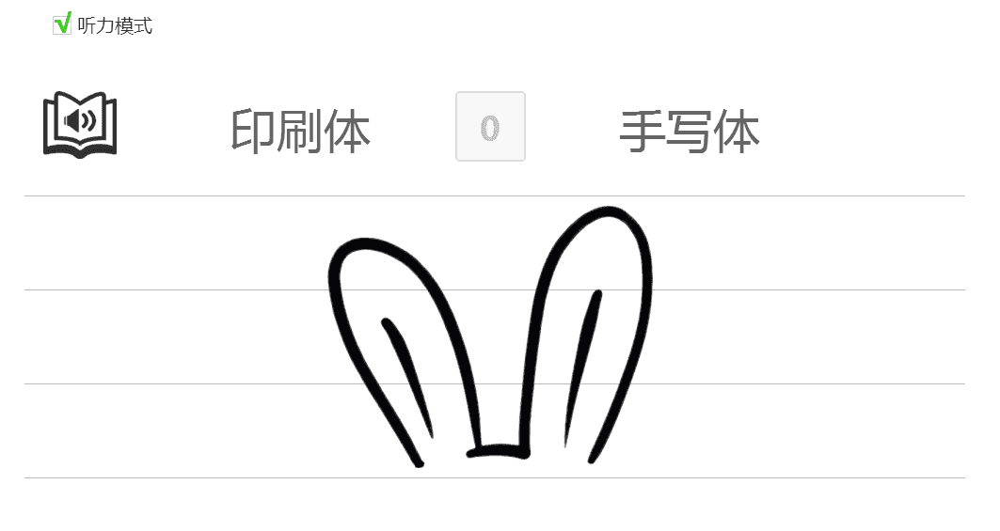

# letter-practice

26 字母学习与键盘输入练习 (适合4-5岁儿童键盘+字母启蒙)

市场上现有的打字学习工具，都默认使用者已经学会 26 个字母了，对于没有学习字母的儿童难度有些大，用来启蒙并不是十分恰当的  
为了填补这中间的一段过渡，特制作了本学习工具：每出现一个字母都能朗读，并给出印刷体和手写体示范

## 界面截图
**普通模式**  
  
**听力模式**  

## Demo
[ [字母练习·在线示范>>](http://tevinli.github.io/letter-practice/) ]

## 说明

### 使用方法：

1. 通过敲击键盘 26 个字母进行操作
2. 每个字母都有语音播放
3. 可进行纯听力模式不显示字母
3. 正确错误显示“√”和“×”，有提示音
4. 简单的速度统计，数字越大颜色越绿

### 应用参考：

**阶段一**：  
儿童自己琢磨键盘上哪个字母和屏幕上显示的一样，并通过按下此按键获得“√”和正确提示音  

**阶段二**：   
儿童通过听力在键盘上按下正确按键获得“√”和正确提示音  

**阶段三**：  
等字母有一些熟悉后由大人带领开始教键盘指法，每个手指放到正确位置上，并负责固定区域的按键  

**阶段四**：  
练习至键盘盲打，再进一步，听力+键盘双盲打  
