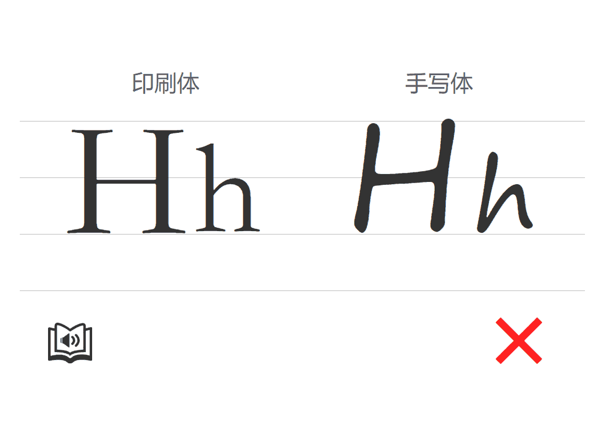

# letter-practice

26 字母学习与键盘输入练习 (适合4-5岁儿童键盘+字母启蒙)

市场上现有的打字学习工具，都默认使用者已经学会 26 个字母了，对于没有学习字母的儿童难度有些大，用来启蒙并不是十分恰当的  
为了填补这中间的一段过渡，特制作了本学习工具：每出现一个字母都能朗读，并给出印刷体和手写体示范

### 说明：

1. 通过敲击键盘字母操作
2. 每个字母都有语音播放
3. 正确错误也有提示音

### 应用：

**阶段一**：  
儿童自己琢磨键盘上哪个字母和屏幕上显示的一样，并通过按下此按键获得“√”的正确提示 

**阶段二**：  
等 26 个字母有一些熟悉后由大人带领开始教指法，每个手指放到正确位置上，每个手指按正确区域的按键

**阶段三**：  
如果需要，可以一直练习到可以盲打

 
 

## Demo
[字母练习·在线示范>>](http://tevinli.github.io/letter-practice/)
